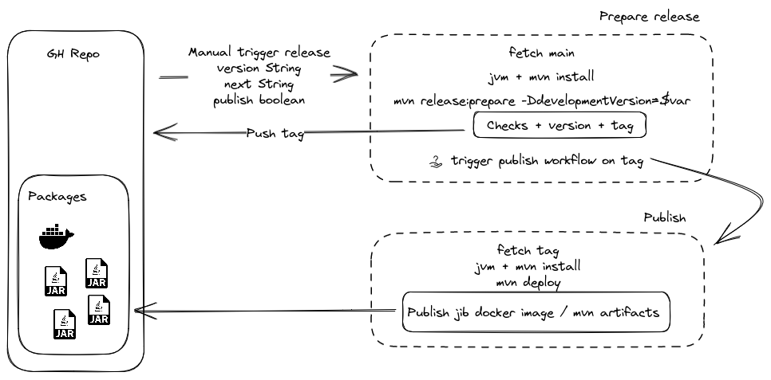
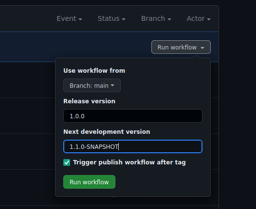

# Packaging & Releases

This documentation present the packages by project and release workflow for Condutkor Gateway project.

## Packages

Each release should ensure and provide the following packages to be published :
 - Gateway-core all in one jar
 - Interceptor-framework jar
 - Gateway docker image with Gateway-core jar

For now the packages are deployed into the repository [github packages](https://github.com/orgs/conduktor/packages?repo_name=conduktor-gateway)  

## Github action workflow

### Overview

### Prepare 

This workflow is to check the codebase for a release and then commit/tag version updates to prepare for next development iteration.

Workflow :
 - Checkout from the branch selected as input
 - Configure the CI (git user, maven, java, ...)
 - Check that projects tests and packages and ok
 - Update all project's versions based on optional input or detect it from latest commit (0.9.0-SNAPSHOT become 0.9.0)
 - Tag the repository with the version
 - Update all project's versions to next development version (optional input or automatic increase by maven release)
 - Push version updates and tag to the repository
 - Trigger [publish workflow](#publish) if input publish is set to true

It can be started [here](https://github.com/conduktor/conduktor-gateway/actions/workflows/prepare_release.yml) and have 4 inputs 
 - **branch** : The rbanch to release from
 - **Release version** (_optional_) : The version you want to release to
 - **Next development version** (_optional_) : The next version you want to develop to
 - **Trigger publish workflow after tag** : To trigger the publish workflow from the tag

### Publish

This workflow creates the final artifacts and publish them based on a git reference.

Workflow :
 - Checkout from the git reference input (commit id, branch, tag)
 - Configure the CI (docker login, maven, java, ...)
 - Rebuild the projects
 - Publish the projects (except `logger-interceptor`)
 - 
It can be started manually [here](https://github.com/conduktor/conduktor-gateway/actions/workflows/publish.yml) with the github ref to publish from.
It should be manually started by [prepare release workflow](#prepare) in most cases but you could publish any github reference (versioning is not done by this workflow).